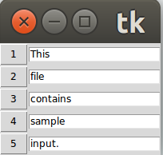

# Clipboard
	


Python utility for making phrases easily accessible with a single click.

Program reads in a file and presents each line with a button to enable the user to copy the phrase to the clipboard.

### Usage:

Clone respository:

```
git clone https://github.com/FrancisLawlor/Clipboard_Python.git
```

Navigate to local repo run:

```
./clipboard.py -l words.txt
```

### Options

l - specify name of file to read phrases from.